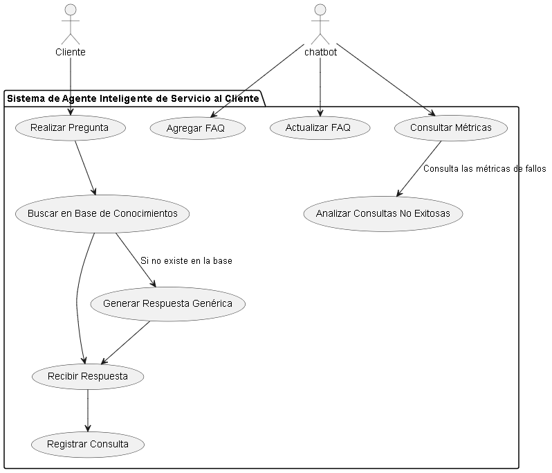
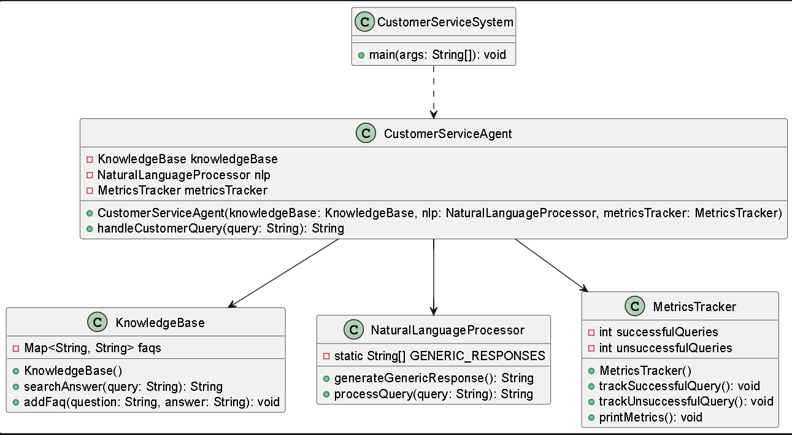
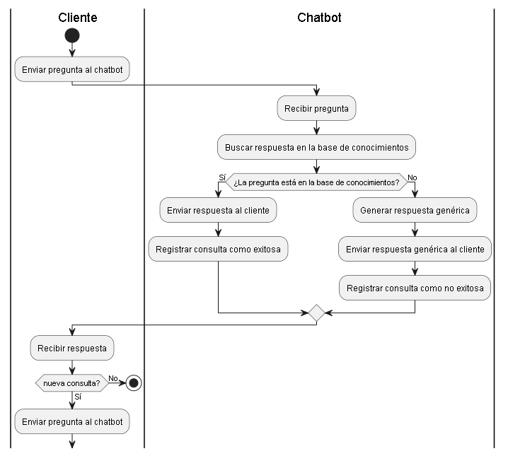
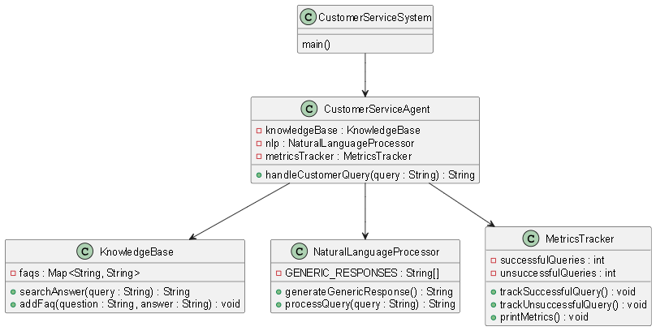
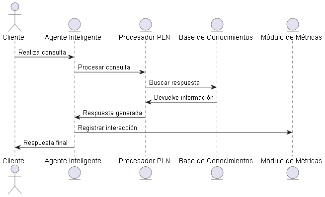
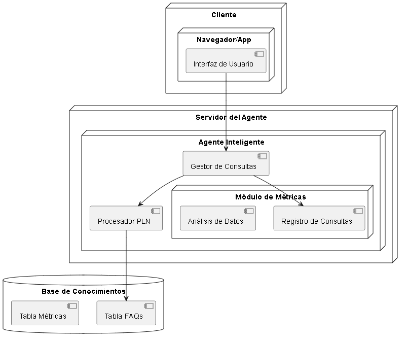

0# Proyecto: Agente Inteligente para Servicio al Cliente y Resolución de Dudas
---
## Objetivo General
Desarrollar un agente inteligente capaz de proporcionar un servicio al cliente eficiente y efectivo, respondiendo de manera precisa a las preguntas y resolviendo dudas comunes, mejorando así la experiencia del usuario y optimizando los recursos de la empresa.

## Objetivos Auxiliares
1. **Implementar un sistema de procesamiento de lenguaje natural (PLN):** Para que el agente sea capaz de entender y responder de manera coherente a las preguntas formuladas en lenguaje natural.
2. **Desarrollar una base de conocimientos dinámica:** Que permita al agente acceder y actualizar la información relevante para responder a las consultas de los clientes de manera precisa y actualizada.
3. **Integrar el agente inteligente en los canales de atención existentes:** Como sitios web, aplicaciones móviles y redes sociales, para garantizar una accesibilidad constante y uniforme.
4. **Monitorear y evaluar el rendimiento del agente:** Mediante métricas de satisfacción del cliente y análisis de efectividad, para realizar mejoras continuas en el sistema.

## Justificación
La implementación de un agente inteligente para el servicio al cliente es fundamental en la era digital actual, donde los usuarios demandan respuestas rápidas y precisas. Un agente de este tipo no solo mejora la eficiencia operativa al reducir la carga de trabajo humano, sino que también asegura una disponibilidad 24/7, lo cual es clave para aumentar la satisfacción del cliente y la lealtad a la marca. Además, la automatización del servicio al cliente permite que el personal humano se enfoque en tareas más complejas y de mayor valor añadido.

## Planteamiento del Problema
En el contexto actual, las empresas se enfrentan al desafío de atender a un número creciente de consultas y solicitudes de los clientes, lo cual puede saturar los canales de atención y afectar negativamente la experiencia del usuario. Este problema se ve agravado por la necesidad de mantener una respuesta rápida y precisa, lo que no siempre es posible con la intervención humana exclusiva. La falta de un sistema eficiente de servicio al cliente puede llevar a la insatisfacción, pérdida de clientes y una mala reputación de la empresa. Por lo tanto, es necesario un agente inteligente que pueda gestionar y resolver las dudas de los clientes de manera automática, precisa y rápida.

## Diagramas
A continuación, se incluyen los diagramas representativos del sistema de agente inteligente.

### Diagrama de Casos de Uso


### Diagrama de Clases


### Diagrama de Flujo


### Diagrama de Objetos


### Diagrama de Colaboración


### Diagrama de Despliegue


### Diagrama de Estado
! [Diagrama de Estado](images/diagrama de estado.png)

## Ejemplo de Código

# Agente Inteligente para Servicio al Cliente en Java

Este proyecto es un ejemplo de un sistema de agente inteligente para servicio al cliente, construido en Java. Incluye varias clases que modelan distintos componentes del sistema, como la base de conocimientos, el procesamiento de lenguaje natural y el seguimiento de métricas. 

```java
import java.util.HashMap;
import java.util.Map;
import java.util.Random;

// Clase para gestionar la base de conocimientos del agente
class KnowledgeBase {
    private Map<String, String> faqs;

    public KnowledgeBase() {
        faqs = new HashMap<>();
        faqs.put("horarios", "Nuestro horario de atención es de 9:00 AM a 6:00 PM de lunes a viernes.");
        faqs.put("envíos", "Realizamos envíos a nivel nacional con un tiempo estimado de entrega de 3 a 5 días hábiles.");
        faqs.put("devoluciones", "Las devoluciones son aceptadas dentro de los 30 días posteriores a la compra, con el producto en su empaque original.");
        faqs.put("contacto", "Puedes contactarnos a través del correo support@example.com o llamando al 123-456-7890.");
    }

    // Búsqueda básica en las preguntas frecuentes
    public String searchAnswer(String query) {
        for (String key : faqs.keySet()) {
            if (query.toLowerCase().contains(key)) {
                return faqs.get(key);
            }
        }
        return null;
    }

    public void addFaq(String question, String answer) {
        faqs.put(question.toLowerCase(), answer);
    }
}

// Clase para simular procesamiento de lenguaje natural básico
class NaturalLanguageProcessor {
    private static final String[] GENERIC_RESPONSES = {
        "Lo siento, no tengo esa información en este momento.",
        "Por favor, podría reformular su pregunta.",
        "Estoy aquí para ayudar, pero no entiendo su consulta."
    };

    public String generateGenericResponse() {
        Random random = new Random();
        return GENERIC_RESPONSES[random.nextInt(GENERIC_RESPONSES.length)];
    }

    public String processQuery(String query) {
        // Simulación de procesamiento de lenguaje natural (PLN)
        return query.trim().toLowerCase();
    }
}

// Clase principal del agente de servicio al cliente
class CustomerServiceAgent {
    private KnowledgeBase knowledgeBase;
    private NaturalLanguageProcessor nlp;
    private MetricsTracker metricsTracker;

    public CustomerServiceAgent(KnowledgeBase knowledgeBase, NaturalLanguageProcessor nlp, MetricsTracker metricsTracker) {
        this.knowledgeBase = knowledgeBase;
        this.nlp = nlp;
        this.metricsTracker = metricsTracker;
    }

    public String handleCustomerQuery(String query) {
        String processedQuery = nlp.processQuery(query);
        String answer = knowledgeBase.searchAnswer(processedQuery);

        if (answer != null) {
            metricsTracker.trackSuccessfulQuery();
            return answer;
        } else {
            metricsTracker.trackUnsuccessfulQuery();
            return nlp.generateGenericResponse();
        }
    }
}

// Clase para registrar métricas de interacción
class MetricsTracker {
    private int successfulQueries;
    private int unsuccessfulQueries;

    public MetricsTracker() {
        this.successfulQueries = 0;
        this.unsuccessfulQueries = 0;
    }

    public void trackSuccessfulQuery() {
        successfulQueries++;
    }

    public void trackUnsuccessfulQuery() {
        unsuccessfulQueries++;
    }

    public void printMetrics() {
        System.out.println("Métricas del Agente de Servicio al Cliente:");
        System.out.println("Consultas exitosas: " + successfulQueries);
        System.out.println("Consultas sin respuesta: " + unsuccessfulQueries);
    }
}

// Clase principal para probar el sistema de agente inteligente
public class CustomerServiceSystem {
    public static void main(String[] args) {
        KnowledgeBase knowledgeBase = new KnowledgeBase();
        NaturalLanguageProcessor nlp = new NaturalLanguageProcessor();
        MetricsTracker metricsTracker = new MetricsTracker();
        CustomerServiceAgent agent = new CustomerServiceAgent(knowledgeBase, nlp, metricsTracker);

        // Ejemplos de consultas
        String[] customerQueries = {
            "¿Cuáles son sus horarios?",
            "¿Hacen envíos a nivel nacional?",
            "¿Puedo hacer una devolución?",
            "¿Cuál es su número de contacto?",
            "¿Ofrecen soporte en otros idiomas?"
        };

        for (String query : customerQueries) {
            System.out.println("Cliente: " + query);
            System.out.println("Agente: " + agent.handleCustomerQuery(query));
            System.out.println();
        }

        // Imprimir métricas de interacción
        metricsTracker.printMetrics();
    }
}
```
## Conclusión
La creación e implementación de un agente inteligente para el servicio al cliente y resolución de dudas se presenta como una solución efectiva para enfrentar los desafíos actuales en la atención al cliente. Este proyecto no solo busca mejorar la eficiencia en la resolución de consultas, sino también incrementar la satisfacción del cliente, optimizar recursos y fortalecer la imagen de la empresa. Al utilizar tecnologías avanzadas como el procesamiento de lenguaje natural y la inteligencia artificial, se puede ofrecer un servicio de alta calidad que responde a las necesidades de los usuarios en tiempo real, lo que resulta en un valor añadido significativo para la empresa.
