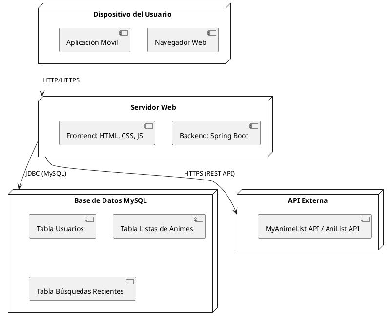

# Diagrama de Despliegue UML para Aplicación de Gestión de Animes

## Descripción General
El diagrama de despliegue representa los nodos y conexiones de una aplicación web que permite a los usuarios explorar, buscar y gestionar información sobre animes.

## Nodos y Componentes

### 1. **Dispositivo del Usuario**
- **Navegador Web**: Permite a los usuarios interactuar con la interfaz frontend.
- **Aplicación Móvil**: Brinda acceso desde dispositivos móviles.

### 2. **Servidor Web**
- **Frontend**: Implementado con HTML, CSS y JavaScript, maneja la presentación y experiencia de usuario.
- **Backend**: Desarrollado con Spring Boot, gestiona solicitudes, consultas a la base de datos y consumo de API externa.

### 3. **Base de Datos MySQL**
Almacena la información estructurada necesaria para la aplicación:
- **Tabla Usuarios**: Información de usuarios registrados (nombre, correo, contraseñas cifradas).
- **Tabla Listas de Animes**: Listas personalizadas de los usuarios (estado: viendo, completado, pendiente).
- **Tabla Búsquedas Recientes**: Historial de consultas realizadas por los usuarios.

### 4. **API Externa**
- Utiliza servicios como MyAnimeList o AniList para obtener información actualizada sobre animes.
- Conexión mediante HTTPS (REST API).

## Conexiones y Protocolos
- **Dispositivo del Usuario ↔ Servidor Web**: HTTP/HTTPS para solicitudes y respuestas entre cliente y servidor.
- **Servidor Web ↔ Base de Datos**: JDBC para consultar y actualizar información en MySQL.
- **Servidor Web ↔ API Externa**: HTTPS para consumir datos de animes en tiempo real.

## Código PlantUML

